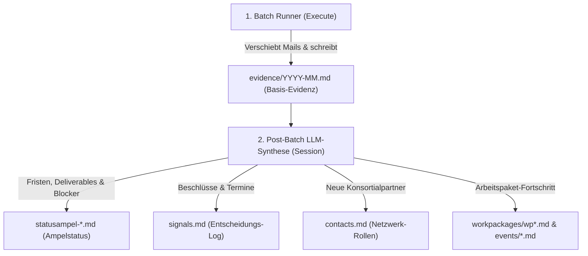

# Feature Requests — Office Intelligence & Mail-Desk

Dieses Dokument fasst die in der Session ab 01.09.2026 erarbeiteten Architektur- und Funktionserweiterungen für das Repository `office-intelligence` (insbesondere die Skills `project-catalog-entry` und `mail-desk`) zusammen. Der Status wurde am 12.09.2026 gegen den Session-Ausgangspunkt `fb9ba3e5` abgeglichen und bis zur Mail-Desk-Härtung FR-07 fortgeschrieben.

## Statusabgleich zur Session

| ID | Status | In dieser Session umgesetzt | Kurzurteil |
| --- | --- | --- | --- |
| `FR-01` | ✅ abgeschlossen | v3-Schema, Vorlagen, Beispielkatalog, Validator, konservatives Migrationswerkzeug, Tests und produktiver Backfill | Der BOKU-Katalog ist vollständig v3-valid; der einzige EVOLVE-Hinweis `unstable_checkpoint` wurde konkret akzeptiert, ohne eine Meilenstein-ID zu erfinden. |
| `FR-02` | ✅ abgeschlossen | FR-02a: hierarchisches v3-Artefakt-Matching; FR-02b: Zweitpass-Volltext; FR-02c: strukturierte Evidence | Artefakt-Treffer, Review-Kandidaten, sichere Volltext-Reklassifikation und neutrale, kataloggestützte Project-Evidence sind vollständig verfügbar. |
| `FR-03` | ✅ abgeschlossen — FR-03a, FR-03b1 und FR-03b2a–c | Ja: Signalvertrag, Subtopic-Matching, Cagliari-Anreicherung, Subtopic-Cloud-Sync sowie Operations- und Event-Vertrag | Events benötigen keinen eigenen Cloud-Speicher; ein optionaler Selektor kann bei Cloud-Bezug einen geerbten Parent-/Subtopic-Speicher wählen. Keine automatische produktive Event-Migration. |
| `FR-04` | ✅ abgeschlossen — FR-04a–d | Ja: kataloggestützter Dossier-Manifest-, Review/Apply-, Synthese- und Fach-Handoff-Pfad | `batch-dossier.json` bereitet einen begrenzten Inspect-Auftrag plus Cloud-Atlas-Preflight vor; `dossier_apply` führt nur einen separat geprüften, hashgebundenen Routingauftrag über Execute→Verify aus; `dossier_synthesis` und `dossier_handoff` erzeugen daraus ausschließlich quellengebundene, reviewbare Synthese-, Cloud-Atlas- und Task-Desk-Handoffs. |
| `FR-05` | ✅ abgeschlossen | Ja: alle acht Handler ausgelagert | `search`, `resolve`, `inspect`, `draft`, `sync_sent`, `execute`, `verify` und `pipeline` liegen in `scripts/core/modes/`; der durch spätere Dossier-Modi erweiterte Runner umfasst aktuell 1.077 physische Zeilen und behält CLI-/Dispatch-/Kompatibilitätsfassaden sowie gemeinsame Fetch-Helper. |
| `FR-06` | ✅ abgeschlossen | Ja: U-1 bis U-5, manueller Pilot, Telemetrie, reviewbare Targets und Session-Handoff | Die technische Zwei-Stufen-Architektur ist abgeschlossen; die konkrete inhaltliche Synthese bleibt absichtlich eine LLM-geführte Laufzeitpflicht und wird nicht vom Python-Runner behauptet oder automatisiert. |
| `FR-07` | 🟡 teilweise umgesetzt | H0-Recovery sowie H1–H4 abgeschlossen; H5 mit belastbaren Teilgrundlagen | Der unterbrochene BOKU-Lauf ist reconciliert; unmittelbare Runnerfehler, der kontrollierte Standard-Batch-Einstieg, die Workspace-gebundene Transport-Readiness und das first-class Recovery sind behoben. Das Completion-/Synthese-Gate bleibt als letztes Paket. |

`🟠` bezeichnet dokumentierte Planung ohne vollständige Funktionsimplementierung, `🟡` eine belastbare Teilgrundlage, `⬜` ein noch nicht begonnenes Ziel und `⏸️` ein bewusst depriorisiertes Vorhaben.

---

## Inhaltsübersicht

1. [FR-01: Schema-Erweiterung für `projects.json` & `project-catalog-entry`](#fr-01-schema-erweiterung-für-projectsjson--project-catalog-entry)
2. [FR-02: Hierarchische WP-/Deliverable-Erkennung & Full-Body-Eskalation in `mail-desk`](#fr-02-hierarchische-wp-deliverable-erkennung--full-body-eskalation-in-mail-desk)
3. [FR-03: Subtopic-Strukturierung & Signalisierung in `topics.json`](#fr-03-subtopic-strukturierung--signalisierung-in-topicsjson)
4. [FR-04: Thematischer Dossier-Modus / Projekt-Fokus-Workflow (`batch-dossier.json`)](#fr-04-thematischer-dossier-modus--projekt-fokus-workflow-batch-dossierjson)
5. [FR-05: Modulare Reorganisation des Batch-Runners (`scripts/core/modes/`)](#fr-05-modulare-reorganisation-des-batch-runners-scriptscoremodes)
6. [FR-06: Post-Batch LLM Projekt-Synthese & Knowledge-Layer Synchronisation](#fr-06-post-batch-llm-projekt-synthese--knowledge-layer-synchronisation)
7. [FR-07: Kontrollierte Mail-Desk-Batches und Recovery-Härtung](#fr-07-kontrollierte-mail-desk-batches-und-recovery-härtung)

---

## FR-01: Schema-Erweiterung für `projects.json` & `project-catalog-entry`

**Status:** ✅ **Abgeschlossen.** Das normative v3-Schema, Vorlagen, generische Fixtures, Validator und ein konservatives Migrationswerkzeug sind vorhanden. Der produktive BOKU-Katalog wurde nach geprüftem Gesamtdry-run atomar auf v3 migriert und erneut validiert.

### Problemstellung
Vor FR-01 wurden Workpackages in [`projects.json`](../../boku-user/memory/references/projects/projects.json) nur flach geführt. Tasks (z. B. `T1.7`), Deliverables (z. B. `D1.2`) und Milestones (z. B. `MS1`) lagen lediglich als unstrukturierte Strings in `"aliases"`.
- Dem Skill [`project-catalog-entry`](skills/project-catalog-entry/SKILL.md) fehlte ein normatives Schema für Teilaufgaben und Meilensteine.
- Es war maschinell nicht ersichtlich, welche Aufgaben bei der BOKU liegen (`boku_role`, z. B. *Co-Lead Quality*) und welche Partner welche Deliverables verantworten.

### Ziel-Spezifikation

1. **Strukturierung von `workpackages`:**
   - Jedes WP erhält strukturierte Listen für `tasks` und `deliverables`.
   - Felder für `lead` und `boku_role`.
2. **Milestones auf Projektebene:**
   - Meilensteine spannen oft über mehrere WPs und markieren Phasenabschlüsse des Gesamtprojekts. Sie liegen daher direkt auf Projektebene (`milestones: [...]`) mit Verweisen (`related_wps`) und optionalen Vorbedingungen (`prerequisites`).

```json
{
  "id": "meshe",
  "title": "MESHE – Microcredentials Exchange System for Higher Education in Europe",
  "kuerzel": "MESHE",
  "mailbox_folder": "Projekte/MESHE",
  "workpackages": [
    {
      "id": "wp1",
      "number": 1,
      "title": "Project Management, Coordination, Quality and Evaluation",
      "lead": "EUCEN",
      "boku_role": "Co-Lead Quality",
      "status": "active",
      "tasks": [
        {
          "id": "T1.7",
          "title": "Drafting the Quality and Evaluation Plan",
          "lead": "BOKU",
          "keywords": ["Quality Plan", "QM Plan", "Handbook", "Evaluation Plan"]
        },
        {
          "id": "T1.8",
          "title": "Individual Risk Management Grid",
          "lead": "BOKU",
          "keywords": ["Risk Management Grid", "Risk Grid", "Risikoanalyse"]
        }
      ],
      "deliverables": [
        {
          "id": "D1.2",
          "title": "Quality and evaluation plan, including tools IPR and reports",
          "lead": "BOKU",
          "type": "R — Document, report",
          "due_month": "Ongoing, M1–M36"
        }
      ]
    }
  ],
  "milestones": [
    {
      "id": "MS1",
      "title": "Kick-off meeting held",
      "due_month": "M2",
      "related_wps": ["wp1"],
      "prerequisites": "Grant Agreement signed"
    },
    {
      "id": "MS5",
      "title": "Quality Plan approved by consortium",
      "due_month": "M6",
      "related_wps": ["wp1"],
      "prerequisites": "Draft Quality Plan delivered (D1.2)"
    }
  ]
}
```

### Abgrenzung FR-01a / FR-01b

FR-01a liefert `projects.schema.json`, den read-only `validate_projects.py`, schema-v3-Vorlagen und Fixtures. FR-01b1 liefert `scripts/migrate_project_wps.py`: Default-Dry-run, deterministischen Diff, atomaren Apply nur mit kanonisch verifizierter Lock-Ownership, v3-Validierung und Pending-Diagnostics für mehrdeutige Quellen. FR-01b2 führte den separat geprüften produktiven Gesamtdry-run und Backfill aus realen Markdown-Workpackages aus. Der Lauf übernahm nur stabile strukturierte Informationen; insbesondere blieb EVOLVEs Checkpoint ohne stabile MS-ID nach expliziter Akzeptanz von `unstable_checkpoint` unmigriert.

### Kommentar und Schärfung

Die Erweiterung ist Voraussetzung für FR-02. Die Milestone-Inkonsistenz ist bereinigt: Milestones liegen normativ auf Projektebene und verweisen über `related_wps` auf WPs.

Das Migrationsskript liegt als wiederverwendbares Tool unter `skills/project-catalog-entry/scripts/`. Es arbeitet standardmäßig im Dry-run, ist idempotent, schreibt atomar nur nach explizitem Apply und Lock-Check und migriert mehrdeutige Quellen nie autonom. Der reale FR-01b2-Backfill ist abgeschlossen; spätere Katalogmigrationen bleiben eigenständige, erneut zu prüfende Läufe.

---

## FR-02: Hierarchische WP-/Deliverable-Erkennung & Full-Body-Eskalation in `mail-desk`

**Status:** ✅ Abgeschlossen. **FR-02a, FR-02b und FR-02c sind abgeschlossen:** Der Classifier löst nach einem gewählten Projekt schema-v3-konform Workpackages, Tasks, Deliverables und projektweite Milestones aus der aktuellen Mail auf. Exakte Codes überwiegen; bei Mehrdeutigkeit bleiben Kandidaten sichtbar, ohne einen Einzelwert zu erfinden. Thread-Vererbung bleibt auf dem Projektroot und FR-06-Telemetrie/Handoff unverändert. Die signalgesteuerte Volltextstufe liest bei dokumentierten Triggern exakt denselben Envelope ohne `--preview`, reklassifiziert ihn und hält Full-Read-Fehler fail-closed in Review. Projekt-Evidence verwendet ausschließlich eindeutige Decision-Scalars und Katalogdaten, bleibt bei Mehrdeutigkeit neutral und speichert keinen Mailbody.

### Problemstellung
Vor FR-02a matchte [`scripts/core/classifier.py`](skills/mail-desk/scripts/core/classifier.py) Mails nur gegen Root-Metadaten von Projekten. Bei einer Mail wie *„Mesche QM Plan Handbook 1. Draft“* entstand dadurch lediglich ein generischer Evidenzeintrag (*„Projektbezogene Abstimmung zu MESHE“*), ohne Bezug zu Deliverable `D1.2` oder Task `T1.7`. FR-02a ergänzt den strukturierten Decision-Kontext; Evidence bleibt absichtlich unverändert. Zudem werden standardmäßig nur die ersten 30 Zeilen Preview geladen.

### Ziel-Spezifikation

1. **Hierarchisches Matching (`classifier.py`):**
   - Auswertung der neuen `tasks`-, `deliverables`- und `milestones`-Objekte im Speicher.
   - Erkennung von Codes (`T1.7`, `D1.2`, `MS5`) sowie zugehörigen Fachbegriffen im Betreff und Mailtext.
2. **Programmatische Lesegrad-Eskalation (`Full Body`):**
   - Bei begrenzten Artefakt-/Kontextsignalen (*„QM Plan“*, *„Draft“*, *„Handbook“*, *„Deliverable“*, *„Agreement“*, *„Red Flags“*, *„Audit“*, *„Focus Group“*), eindeutig aufgelösten Artefaktcodes, sichtbaren Action-/Reply-Bitten oder unzureichender Preview-Evidenz ruft der Runner automatisch `himalaya message read <id>` ohne `--preview` ab. Ein aus dem Preview abgeleitetes `needs_reply` ist kein alleiniger Trigger.
3. **Präzise Evidenz-Generierung:**
   - Deterministische Strukturierung des Monatslogs:
     ```markdown
     - 2026-02-17 — Mesche QM Plan Handbook 1. Draft.
       - Message-ID: `69949823020000f1000ce9b8@gwia1.boku.ac.at` (Christina Paulus)
       - Kontext: [MESHE | WP1 / T1.7 / D1.2 (Quality and Evaluation Plan, Lead: BOKU)]
       - Aussagekern: BOKU legt ersten Entwurf für D1.2 / T1.7 (QM Plan Handbook) vor.
     ```

### Kommentar und Schärfung

FR-02 sollte erst nach dem stabilen Schema aus FR-01 umgesetzt werden. Das Matching sollte exakte Codes (`T1.7`, `D1.2`, `MS5`) höher gewichten als freie Keywords und bei Mehrdeutigkeit mehrere Kandidaten ausgeben, statt einen scheinbar sicheren Treffer zu erfinden. Der erkannte Kontext sollte zusätzlich strukturiert im Decision-/Evidence-Objekt stehen; die Markdown-Zeile allein ist keine gute Maschinenschnittstelle.

Die Full-Body-Logik sollte als klarer Zwei-Pass-Flow gebaut werden: Preview klassifizieren, definierte Signale oder unzureichende Evidenz feststellen, dann genau diese Nachricht vollständig lesen und erneut klassifizieren. `needs_reply` allein ist als Trigger zu zirkulär, weil es zunächst selbst aus dem gekürzten Inhalt abgeleitet wird. Contract-Tests sollten außerdem sicherstellen, dass Volltext nur bei den dokumentierten Triggern geladen wird und ein Read-Fehler keine unvollständige Aussage als gesichert protokolliert.

### Erkenntnisse aus dem 10-Mail-Pilotlauf (07.09.2026)

- **Fehlende WP/Task-Ebene im Manifest:**
  Bei Envelope 9060 (*„MESHE WP2 BOKU Focus Group“*) und Envelopes 9055/9056 (*„Li4LaM: Finding a date to discuss the Handbook for Course Design, Tools and the Process of RPL“*) erkannte der Classifier nur das Root-Projekt (`meshe`, `li4lam`). Weder `workpackage: "wp2"`, `task: "t2.2"` noch der RPL-Handbook-Kontext wurden im JSON abgebildet.
- **Notwendigkeit signalgestützter Full-Body-Eskalation:**
  Im 30-Zeilen-Preview von Env 9060 erschien nur eine kurze Höflichkeitsfloskel. Erst der gezielte Volltextabruf (`himalaya message read 60`) deckte den kritischen Sachverhalt auf: Die BOKU-Fokusgruppe konnte am 18.05. mangels Teilnehmern nicht stattfinden, Martin informierte WP2-Lead Lyndsey El Amoud (UCC) und diese mahnte höchste Dringlichkeit an. Ohne Full-Body-Eskalation wäre dieses kritische Projektsignal im Batch verloren gegangen.
- **Zielstruktur im Manifest:**
  Das `decision`-Objekt im Manifest sollte künftig strukturiert `workpackage`, `task` und `read_escalation` tragen:
  ```json
  "decision": {
    "kind": "project",
    "id": "meshe",
    "workpackage": "wp2",
    "task": "t2.2",
    "read_escalation": {
      "level": "full_body",
      "triggers": ["focus group", "wp2"]
    }
  }
  ```

---

## FR-03: Subtopic-Strukturierung & Signalisierung in `topics.json`

**Status:** ✅ Abgeschlossen — **FR-03a, FR-03b1 und FR-03b2a–c abgeschlossen.** Der normative Vertrag umfasst `subtopics[].aliases`, `keywords`, `typical_subject_patterns`, `contacts`, optionales `reference_md`, `cloud_sync`, `operations`, `events` und `status`. Der Classifier löst aktive Subtopics und – erst danach – aktive oder Legacy-statuslose Operations beziehungsweise strukturell valide terminierte Events konservativ und deterministisch auf. Eine eindeutige Cagliari-/IACEE-Subtopic-`subject_pattern` kann einen schwächeren generischen EUCEN-Root-Treffer überstimmen; Gleichstände bleiben fail-closed. Katalogisierte aktive Subtopic-`cloud_sync`-Storages sind per expliziter Topic-/Subtopic-CLI ausführbar, ohne Parent-Fallback und mit verschachteltem Zeitstempel. Operations sind Dauerprozesse; Events haben ein kanonisches Dossier und ein festes Event-Evidence-Verzeichnis, besitzen aber keinen eigenen Cloud-Speicher. Bei Cloud-Bezug kann ein optionaler Selektor einen geerbten Parent-/Subtopic-Speicher eindeutig wählen. Parent-Routing bleibt unverändert. **FR-03 führt ausdrücklich keine automatische Cagliari- oder andere produktive Event-Migration aus.**

### Problemstellung
Themen (Topics) sind Linien-, Dauer- und Betriebsaufgaben ohne starre EU-Workpackages. Bisher sind `subtopics` in [`topics.json`](../../boku-user/memory/references/topics/topics.json) häufig leere Arrays ohne funktionale Routing-Signale, was zu unpräziser Klassifikation führt.

### Ziel-Spezifikation
Strukturierte Anreicherung der Subtopics mit eigenen Signal-Attributen:
- `keywords`: Spezifische Fachbegriffe (z. B. *„stundensaldo“*, *„argedata“*, *„zeiterfassung“*).
- `typical_subject_patterns`: Typische Betreff-Muster (z. B. *„Übertragung Stundensaldo“*, *„[Ticket#...“*).
- `contacts`: Funktionsadressen und zuständige Kolleg:innen (z. B. `h17700_argedata@boku.ac.at`).
- Saubere Trennung von Subtopics, Events/Konferenzen (`events/<slug>/`) und Dauerprozessen (`operations/`).

### Kommentar und Schärfung

Die Idee ist fachlich stimmig, sollte aber das bereits etablierte Feld `typical_subject_patterns` verwenden und nicht mit `typical_patterns` ein zweites Vokabular einführen. Der Classifier sollte einen Subtopic-Treffer als strukturierten Kontext (`topic_id`, `subtopic_id`, Match-Gründe) zurückgeben; bloßes Zusammenführen aller Signale auf Parent-Ebene verliert genau die gewünschte Präzision.

FR-03a legt die Kontaktregel fest: Ein Subtopic-Kontakt ergänzt nur dann die Auflösung, wenn der Parent bereits unabhängig durch ein Betreffsignal belegt ist und die Adresse genau einem aktiven Subtopic gehört. `operations/` bleibt für FR-03b fachlich zu definieren: Dauerprozess, Ablageobjekt und Evidenzpfad müssen klar von einem Subtopic und einem Event unterscheidbar sein.

### Erkenntnisse aus dem 10-Mail-Pilotlauf (07.09.2026)

- **Vermeidung von `"evidence": null` bei Topic-Mails:**
  Im Pilotlauf wurden vier Mails zum Thema EUCEN-Konferenz / Dienstreise Cagliari (Env 9057, 9058, 9059, 9062) verarbeitet. Da der Classifier bisher nur auf Topic-Ebene matcht, wurden die Mails generisch als `Themen/Netzwerke` klassifiziert und erhielten `"evidence": null`.
- **Existierende Ziel-Dossiers werden verfehlt:**
  Im Workspace existiert bereits das präzise Subtopic-Dossier `memory/references/topics/dienstreisen/subtopics/2026-06-cagliari-eucen-conference.md`, in welches die Konferenzrechnungen (`spol@unica.it`) und Social-Event-Details (`alice.sgualdini@unica.it`) gehören.
- **Manifest-Anreicherung (FR-03a):**
  Der Classifier erzeugt einen strukturierten Subtopic-Kontext nur bei eindeutigem Treffer. Ein Syntheseziel ist optional und nur zulässig, wenn der Katalog exakt die vorhandene kanonische Subtopic-Datei deklariert; er behauptet weder Event- noch Abschnittssemantik:
  ```json
  "decision": {
    "kind": "topic",
    "id": "dienstreisen",
    "subtopic": "2026-06-cagliari-eucen-conference"
  },
  "evidence": {
    "file": "memory/evidence/topics/dienstreisen/2026-06.md",
    "entry": "… kanonischer Mail-Nachweis mit Message-ID …"
  },
  "synthesis_targets": [
    {
      "file": "memory/references/topics/dienstreisen/subtopics/2026-06-cagliari-eucen-conference.md",
      "type": "subtopic_reference"
    }
  ]
  ```

### Abgeschlossen: FR-03b2b / Operations-Vertrag

- `subtopics[].operations[]` modelliert ausschließlich wiederkehrende oder laufende Dauerprozesse, nicht Events. Jede Operation hat mindestens slug-ID, Titel, `aliases`, `keywords`, `typical_subject_patterns` und Status; ein optionaler `reference_md` darf nur der kanonische Operations-Index sein. Der aktive Arbeitsstand und die monatliche Mail-Evidence haben getrennte, feste Pfade.
- Mail-Desk löst eine Operation nur nach eindeutiger Parent-Topic- und Subtopic-Entscheidung der aktuellen Mail auf. Operationssignale sind kataloggebunden und deterministisch, Kontakte und Thread-Historie liefern keine Operationsvererbung. Gleichstände, doppelte IDs und nichtkanonische Referenzen bleiben fail-closed/reviewbar.

### Abgeschlossen: FR-03b2c / Event-Vertrag

- `subtopics[].events[]` modelliert ausschließlich endliche/terminierte Veranstaltungen. Jedes automatisch auflösbare Event hat slug-ID, Titel, ISO-Daten, kanonisches vorhandenes Dossier und Routingstatus; die optionale Phase bleibt vom Routingstatus getrennt. Ein Event besitzt und benötigt keinen Cloud-Speicher. Nur bei tatsächlichem Cloud-Bezug darf ein optionaler `cloud_storage`-Selektor einen vorhandenen Speicher des Parent-Topics oder Subtopics auswählen.
- Mail-Desk löst Events nur nach Parent-Topic und aktueller Subtopic-Evidenz auf. Doppelte oder ungültige Einträge, fehlende Dossiers, ungültige explizite Storage-Selektoren und Operations-/Event-Konflikte bleiben Kandidaten; sie erzeugen keinen Scalar, keinen Pfad und kein Target. Ein fehlender Storage-Selektor ist dagegen gültig. Die Event-Evidence ist kompatibel mit `recordings/`, `notes/` und `action-items.md`.
- Der Vertrag ergänzt die bestehende Cagliari-Subtopic-Anreicherung, verschiebt oder erzeugt aber keine produktiven Cagliari-/Event-Dateien automatisch.

---

## FR-04: Thematischer Dossier-Modus / Projekt-Fokus-Workflow (`batch-dossier.json`)

**Status:** ✅ Abgeschlossen — FR-04a–d. `dossier` löst ausschließlich eine exakte aktive oder statuslose v3-Projekt-ID aus `projects.json` auf und erzeugt lokal einen begrenzten, reviewbaren `batch-dossier.json`-Inspect-Folgeauftrag sowie einen katalogbasierten Cloud-Atlas-Preflight. Fehlt `project.cloud_sync`, bleibt dieser explizit `not_configured`; Pfade und Storage werden nie erfunden. `dossier_apply` akzeptiert nach separater Human Review nur einen SHA-256-gebundenen kanonischen Execute-Request für exakt dieses Projekt und delegiert nach vollständigem Preflight ausschließlich an Execute→Verify. `dossier_synthesis` validiert den erfolgreichen hash-gebundenen Apply-/Verify-Snapshot und den FR-06-Handoff und erzeugt nur einen EVID-verankerten Synthese-Arbeitsauftrag. `dossier_handoff` akzeptiert anschließend ausschließlich einen hash-gebundenen abgeschlossenen Synthese-Review und bereitet daraus reine Cloud-Atlas- und Task-Desk-Empfangshandoffs vor. Alle Handoffs bleiben reviewbar; sie führen weder Cloud-, Mailbox-, Knowledge-, Task- noch Todoist-Mutationen aus. Action-Candidates sind ausschließlich an Mail-EVID-Anker gebunden und werden von Task-Desk erst nach dessen Routing/Dedupe/Attribution beurteilt.

### Problemstellung
Bisher erfolgt die Abarbeitung der Mailbox rein chronologisch (Tag für Tag über alle Themen gemischt). Wenn der Nutzer jedoch gezielt an einem Projekt (z. B. `MESHE`) arbeiten möchte, müssen alle dazu gehörenden Mails aus der `INBOX` extrahiert, verarbeitet und die entsprechenden Projektunterlagen vorab synchronisiert werden.

### Ziel-Spezifikation


1. **Manifest-Format (`batch-dossier.json`):**
   ```json
   {
     "mode": "dossier",
     "project": "meshe",
     "source_folder": "INBOX",
     "auto_query_from_catalog": true,
     "max_count": 50,
     "actions": {
       "route_and_index": true,
       "flush_evidence": true,
       "sync_project_references": true,
       "check_todos": true
     },
     "delete_input_on_success": true
   }
   ```
2. **Katalog-gestützter IMAP-Filter:**
   - Der Runner baut aus den Projektmetadaten (Kürzel, Aliase, Domains `@eucen.eu`, Kontakte) automatisch eine optimierte IMAP-Suche auf (`SEARCH (OR (SUBJECT "MESHE") (FROM "eucen.eu"))`).
3. **Integrierter Synthese-Schritt:**
   - Nach dem Verschieben der Mails aktualisiert der Agent automatisch:
     - `statusampel-*.md`
     - `signals.md` (Fristen, Risiken)
     - `contacts.md`
4. **Übergabe in die Arbeitsdokumente:**
   - Ausgabe eines Dossier-Briefings mit direkten Links zu betroffenen Dateien im konfigurierten Cloud-Atlas-Mirror (z. B. `memory/cloud/projects/<project>/<storage_id>/...`) via passendem Dokument-Skill.

### Kommentar und Schärfung

Das Ziel ist nützlich, aber als einzelnes Paket zu groß und überschreitet mehrere Skill-Grenzen. Sinnvoll sind mindestens vier getrennte Schritte: kataloggestützte Suche und Manifest, kontrolliertes Routing/Indexing, reviewbare Synthese sowie Übergabe an `cloud-atlas` und `task-desk`. Der Mail-Desk sollte diese Skills orchestrieren, ihre Fachlogik aber nicht duplizieren.

Die Reihenfolge ist derzeit widersprüchlich: Die Problemstellung verlangt eine Synchronisation der Projektunterlagen vor der Mailbearbeitung, das Diagramm setzt `Memory-Sync` danach. Empfehlenswert ist `Cloud-Atlas Preflight/Sync → Mail Harvest/Triage → Synthese → Action Handover`. Automatische Änderungen an `statusampel`, `signals.md` und `contacts.md` sollten zunächst als Vorschlag mit Quellenankern entstehen; nur deterministische Ergänzungen dürfen ohne inhaltliches Human Gate geschrieben werden. IMAP-/Himalaya-Abfragen müssen adaptergerecht erzeugt, begrenzt und vor der Mutation als Dry-Run sichtbar sein.

---

## FR-05: Modulare Reorganisation des Batch-Runners (`scripts/core/modes/`)

**Status:** ✅ Abgeschlossen. Alle acht Handler (`run_search_mode`, `run_resolve_mode`, `run_inspect_mode`, `run_draft_mode`, `run_sync_sent_mode`, `run_execute_mode`, `run_verify_mode` und `run_pipeline_mode`) liegen in `scripts/core/modes/`. `mail_desk_batch_runner.py` umfasst nach den später ergänzten Dossier-Modi aktuell 1.077 physische Zeilen; er behält den kanonischen CLI-Rand, Dispatch, Kompatibilitätsfassaden und die gemeinsamen Envelope-/Fetch-Helper.

### Problemstellung
Vor dem ersten Modulschnitt lag [`mail_desk_batch_runner.py`](skills/mail-desk/scripts/mail_desk_batch_runner.py) bereits über der 1.500-Zeilen-Schwelle. Basis-Hilfsfunktionen sowie alle acht Modi sind inzwischen in `scripts/core/` ausgelagert. Im Hauptskript verbleiben bewusst nur der CLI-Entrypoint, Konfigurations- und Envelope-Grenzen, Dispatch, Laufzeit-DI-Fassaden und die gemeinsamen Mail-Fetch-Helper.

### Ziel-Spezifikation
Sobald weitere Modi hinzukommen (z. B. der Dossier-Modus oder erweiterte AI-Pipelines) oder die Dateigröße 1.500 Zeilen überschreitet, wird die Modi-Logik in ein Untermodul ausgelagert:

```text
skills/mail-desk/scripts/
├── mail_desk_batch_runner.py       # Schlanker CLI-Dispatcher (~150 Zeilen)
└── core/
    ├── himalaya.py
    ├── index.py
    ├── classifier.py
    ├── evidence.py
    ├── sent_indexer.py
    ├── action_log.py
    └── modes/                      # Ausgelagerte Modus-Handler
        ├── __init__.py
        ├── inspect.py              # run_inspect_mode ✅
        ├── draft.py                # run_draft_mode ✅
        ├── sync_sent.py            # run_sync_sent_mode ✅
        ├── execute.py              # run_execute_mode ✅
        ├── verify.py               # run_verify_mode ✅
        ├── pipeline.py             # run_pipeline_mode ✅
        ├── dossier.py              # run_dossier_mode (FR-04)
        ├── search.py               # run_search_mode ✅
        └── resolve.py              # run_resolve_mode ✅
```

### Kommentar und Schärfung

FR-05 sollte vor FR-04 abgeschlossen werden: Die im Request genannte 1.500-Zeilen-Schwelle war bereits überschritten und wurde durch den ersten Schnitt knapp unterschritten. Die Zielgröße von ungefähr 150 Zeilen für den Dispatcher ist plausibel, sollte aber kein hartes Abnahmekriterium sein; wichtiger sind stabile Imports, genau ein kanonischer Envelope am CLI-Rand und unveränderte Modussemantik.

Die Auslagerung erfolgte inkrementell. `search`, `resolve`, `inspect`, `draft`, `sync_sent`, `execute`, `verify` und `pipeline` sind als FR-05-Schnitt abgeschlossen. Die Regressionen decken Envelope-, Partial-Failure-, Cleanup- und Manifest-Sicherheit sowie die Laufzeit-DI-Fassaden für die Mutations- und Orchestrierungspfade ab. Der später als eigenständiges FR-04a-Paket ergänzte `dossier.py`-Handler erweitert diese Struktur, ohne den abgeschlossenen FR-05-Schnitt rückwirkend umzudeuten.

### Umsetzungsnachweis: inkrementelle Modulschnitte

- `scripts/core/modes/search.py`, `resolve.py`, `inspect.py`, `draft.py`, `sync_sent.py`, `execute.py`, `verify.py` und `pipeline.py` kapseln alle acht Handler und sind unabhängig vom CLI-Entrypoint testbar.
- Der Runner importiert `search` und `resolve` weiterhin direkt. Für die übrigen sechs Modi hält er schmale, gleichnamige Kompatibilitäts-Fassaden: Sie übergeben die bisherigen Runner-Abhängigkeiten zur Laufzeit an die extrahierte Logik. Damit bleiben Dispatch sowie vorhandene Imports und Patch-Schnittstellen stabil, ohne einen Importzyklus zu erzeugen.
- Regressionstests decken Ergebnisform, atomare Ausgabe, Inspection- und Draft-Cache-Semantik, Sent-Synchronisations-Weitergabe, Execute-Routing (Copy → Verify → Delete), Evidence-/Index-/Log-Reihenfolge, Partial Failures, Pipeline-Orchestrierung, Verify-Batch-Dateiauswahl, Konsistenz-/Folder-Checks, Progress-Abschluss, explizite und automatische Fallauflösung sowie Alias-Dispatch ab.

---

## FR-06: Post-Batch LLM Projekt-Synthese & Knowledge-Layer Synchronisation

**Status:** ✅ Abgeschlossen (07.09.2026). Die technische Zwei-Stufen-Architektur umfasst die Pilot-Härtung U-1 bis U-5, den manuellen Pilot, FR-06a-Telemetrie, FR-06b-Targets sowie den FR-06c-Session-Handoff und ist regressionstestbar implementiert. Die konkrete inhaltliche Synthese bleibt absichtlich eine LLM-geführte Laufzeitpflicht: Der Python-Runner erstellt oder ändert keine Wissensdateien und behauptet keinen inhaltlichen Abschluss.

### Problemstellung
Bisher endete der Batch-Workflow operativ mit dem Abschluss des Python-Runners. Dadurch wuchsen zwar die monatlichen Evidenzlogs (`evidence/YYYY-MM.md`), aber die tatsächlichen Arbeits- und Steuerungsdateien der Projekte veralteten:
- **Statusampeln (`statusampel-*.md`)** bildeten neue Meilensteine oder gelöste Blocker nicht ab.
- **Signale (`signals.md`)** verpassten neu vereinbarte Beschlüsse und Fristen.
- **Kontakte (`contacts.md`)** erfassten neu aufgetretene Konsortialpartner nicht.
- **Events (`events/*.md`)** erhielten keine Rückmeldungen über Teilnehmerbestätigungen oder Absagen/Verschiebungen.

Da diese inhaltliche Übertragung semantisches Textverständnis und strategische Einordnung erfordert, kann und soll sie nicht durch starre Regex-Skripte im Python-Runner erfolgen, sondern als **verbindlicher zweiter Schritt (LLM-Synthese)** direkt nach dem Batch-Lauf ausgeführt werden.

### Ziel-Spezifikation (Das 2-Stufen-Protokoll)



1. **FR-06b — Manifest-Erweiterung (`synthesis_targets`) — abgeschlossen:**
   - Jedes Item im Execute-Manifest kann konkrete Zieldateien für die Synthese benennen. Autonome Drafts liefern dabei bewusst `synthesis_targets: []`; erst ein Mensch oder LLM reichert den Draft zwischen `draft` und `execute` reviewbar an:
     ```json
     "synthesis_targets": [
       {
         "file": "memory/references/projects/meshe/events/2026-05-18-fokusgruppe-boku-weiterbildung.md",
         "type": "event_dossier",
         "recommended_action": "update_status"
       },
       {
         "file": "memory/references/projects/meshe/statusampel-boku-p6.md",
         "type": "statusampel",
         "task_anchor": "WP2 — T2.2 FDGs"
       }
     ]
     ```
2. **FR-06a — Execute-/Pipeline-Telemetrie (abgeschlossen):**
   - Beim Abschluss eines `execute`- oder `pipeline`-Laufs emittiert der Runner in `data.telemetry` eine Liste der erfolgreich berührten Projekt- und Topic-Slugs:
     ```json
     "telemetry": {
       "affected_projects": ["meshe", "li4lam"],
       "affected_topics": ["netzwerke", "boku-organisation"],
       "synthesis_required": true
     }
     ```
3. **Verbindliche LLM-Checkliste je berührtem Projekt:**
   - **`statusampel-*.md`:** Gibt es neue Meilensteine, Deliverable-Fortschritte oder veränderte Ampelfarben?
   - **`signals.md`:** Wurden verbindliche Termine, Fristen oder Risiken vereinbart?
   - **`contacts.md`:** Sind neue Schlüsselpersonen aufgetaucht?
   - **`workpackages/wp*.md`:** Gibt es neue Deliverable-Entwürfe oder Teilaufgabenabschlüsse?
   - **`events/*.md`:** Wurden Konferenzrechnungen, Anmeldungen oder Tagungsdetails übermittelt?
4. **FR-06c — Abschlussbericht / Session-Handoff (abgeschlossen):**
   - `execute` und `pipeline` geben einen strikt versionierten, fail-closed
     `synthesis_handoff` aus. Er enthält nur erfolgreiche, gepaarte Project-/Topic-
     Items in stabiler Reihenfolge und bewahrt jede Mail als eigene Evidenzquelle.
     Fehlende Targets setzen `target_selection_required: true`; die Pipeline behält
     einen validen pending Handoff auch bei einem nachfolgenden Verify-Fehler.
   - Bei pending Handoff führt das LLM die quellengebundene Synthese aus und gibt
     danach den kompakten **Projekt-Wissensbericht** aus:
     - *„MESHE: Statusampel für WP2 und Eventdossier aktualisiert (Fokusgruppe BOKU auf verschoben gesetzt).“*
     - *„Li4LaM: Schlüsselkontakt Belachew Yirsaw Alemu ergänzt.“*
     - *„Dienstreisen: EUCEN-Konferenzrechnung in Cagliari-Event verknüpft.“*

### Bereits umgesetzte Arbeiten und offene technische Lücke (Stand 07.09.2026)

1. **Pilot-Härtung U-1 bis U-5 (`mail_desk_batch_runner.py`):**
   - **U-1:** Filterergebnisse werden anhand geparster RFC-Daten, nicht lexikografisch, sortiert.
   - **U-2:** Abruffenster wachsen bis 2.500 Envelopes, damit bekannte IDs neue Mails nicht verdecken.
   - **U-3:** `--query` (`-q`) und `--date` werden für `inspect`, `draft` und `pipeline` bis zum Envelope-Abruf weitergereicht.
   - **U-4:** Himalaya-Query- und Parsefehler werden explizit gemeldet.
   - **U-5:** Lesen und Löschen temporärer Manifeste verwenden einen begrenzten exponentiellen PermissionError-Backoff.
2. **Manuelle Synthese-Leitplanke (`mail-desk/SKILL.md`):**
   - Berührte Steuerungsdateien werden geprüft, aber nur bei belastbaren, mailgebundenen neuen Erkenntnissen geändert. Ein quellengebundener No-op ist zulässig und wird berichtet.
3. **Praxis-Pilot (10 Mails, 18.–20. Mai 2026):**
   - 10/10 Mails fehlerfrei transferiert, verifiziert, indiziert und Basis-Evidenz geschrieben.
   - Die Post-Batch Synthese wurde im Boku-User-Workflow manuell durchgeführt: Ein MESHE-Fokusgruppen-Eventdossier wurde auf Basis des Volltextes von Envelope 60 von `geplant` auf `verschoben / nachzuholen` korrigiert.
4. **FR-06a — umgesetzt:**
   - Der Execute- und Pipeline-Envelope enthält unter `data.telemetry` exakt `affected_projects`, `affected_topics` und `synthesis_required`. Nur erfolgreiche Projekt-/Topic-Items mit nichtleerer String-ID werden in stabiler Batch-Reihenfolge gezählt; Duplikate sowie Review- und Fehlerschritte bleiben außen vor.
   - Die Telemetrie löst keine Synthese aus und verändert keine Wissensdateien.
5. **Abschlussgrenze für FR-06:**
   - Die technische Zwei-Stufen-Architektur ist abgeschlossen. Der Session-Handoff
     löst die nachgelagerte, quellengebundene LLM-Synthese verbindlich aus, aber der
     Python-Runner automatisiert keine Wissensdatei-Änderung und behauptet keinen
     Abschluss. Diese konkrete Inhaltsarbeit bleibt absichtlich eine Laufzeitpflicht
     des LLM unter fortgeltenden Lock- und Approval-Grenzen.

---

## FR-07: Kontrollierte Mail-Desk-Batches und Recovery-Härtung

**Status:** 🟡 Teilweise umgesetzt. Die produktive Incident-Recovery `H0` und das
unmittelbaren Codepakete `H1` und `H2` sind abgeschlossen. `H3` bis `H5`
besitzen belastbare Grundlagen, erfüllen ihre vollständigen Abnahmekriterien aber
noch nicht. Diese Abgrenzung ersetzt keine der abgeschlossenen FR-01–FR-06,
sondern schärft den operativen Batch-Vertrag nach dem abgebrochenen Luna-Lauf.

### Ausgangslage und H0-Recovery

Ein Auftrag zur Verarbeitung von zehn Mails wurde fälschlich direkt als
`--pipeline 10 --order oldest --skip-known` gestartet. Der Runner selektierte nur
sechs Items und mutierte die Mailbox, bevor der fehlende Kontrollpunkt auffiel.
Nach vier vollständig persistierten Items wurde der Lauf unterbrochen; ein fünftes
Item war bereits physisch verschoben. `runner-progress.json` blieb auf `running`,
der Final-Location-Index war nicht fortgeschrieben und eine Tempdatei blieb liegen.

`H0` war die kontrollierte, nicht wiederholende Recovery: fünf Zielpositionen wurden
per Message-ID read-only verifiziert, atomar in den Final-Location-Index übernommen,
der falsche Reply-Fall geschlossen, Evidenz nachgezogen und der alte Run als
`failed` markiert. Aus historischen Fristen wurden keine neuen Todos erfunden.
BOKU-Nachweis: Commit `fa116af`. `H0` ist Incident-Recovery und zählt nicht als
eines der fünf Entwicklungspakete H1–H5.

### Paketübersicht H1–H5

| Paket | Status | Zweck | Umsetzung / Restumfang | Abnahme |
| :--- | :--- | :--- | :--- | :--- |
| `MD-H1` | ✅ abgeschlossen | Unmittelbare Runner-Korrektheit und sichtbare Fehler | `skip_known` gilt in Draft und Pipeline; Sent-Sync scheitert vor Klassifikation/Mutation; Delete ist erreichbar und fail-closed; Teilfehler setzen Progress auf `failed`; nullable Himalaya-Felder sind suchbar; headerlose Reads sind Fehler. Commit `bc00898`. | 192/192 Mail-Desk-Tests, `compileall`, `quick_validate`, `git diff --check` grün. |
| `MD-H2` | ✅ abgeschlossen | Kontrollierter Standardfluss für „verarbeite N Mails“ | `draft → sichtbare Manifest-Review → execute → verify` ist im Skill verbindlich; Pipeline bleibt eine ausdrückliche Ausnahme. Drafts binden `expected_count`, `candidate_count`, `allow_fewer`, Quellordner, Account und `skip_known` hash-gebunden an die Review. Execute stoppt vor jeder Execute-Seitenwirkung bei ungültiger Receipt, Account-/Ordnerdrift, zu wenigen Kandidaten ohne explizites `allow_fewer` oder jedem Mehrbestand. | Regressionen für Exact Match, Default-Stop bei weniger, explizites `allow_fewer`, Stop bei mehr sowie keine Mutation bei Gate-Fehlern. |
| `MD-H3` | ✅ abgeschlossen | Backend-Bindung und schneller Readiness-Preflight | `.agents/mail-desk-backend.json` ist die alleinige credentials-freie Quelle für `backend: "himalaya"` und Account (Name oder explizites `null` für den lokalen Default) in allen mailbox-zugreifenden Fassaden. Ein `--account`-Wert kann diese Auswahl nicht übersteuern und stoppt bei Abweichung; H2-/FR-04-Accounts müssen exakt passen. Execute und explizite Pipeline lesen vor ihrem Handler einmal maximal eine Envelope (10 Sekunden, ein Versuch) und geben das kanonische `mailbox_readiness`-Envelope weiter. | Regressionen für fehlende Konfiguration, falschen Account, Timeout, fehlenden Adapter, ungültige Minimalantwort, keine Handler-/Mutation bei Gate-Fehlern, gebundenes Read-only-Verhalten und kanonisches Envelope; vollständige Mail-Desk-Suite, `compileall`, `quick_validate`, `git diff --check`. |
| `MD-H4` | ✅ abgeschlossen | Unterbrechungsjournal und first-class Reconcile | `SIGINT` und Timeouts enden im Journal und Progress sichtbar als `aborted`. Das atomische Journal führt jede normalisierte Message-ID durch `selected` → Copy/Verify/Delete → Index/Log/Evidence. `reconcile` ist first-class und standardmäßig read-only; eine explizit freigegebene Reparatur ergänzt ausschließlich fehlende lokale Daten nach erneuter Zielverifikation. Gemeinsame Writer folgen nur auf eine verifizierte finale Location. | Fault-Injection nach Copy, Verify, Delete, Index, Log und Reply; Resume erzeugt weder Doppel-Copy/-Delete noch Doppel-Log/-Reply/-Evidence. |
| `MD-H5` | 🟡 teilweise | Verbindliches Completion-/Synthese-Gate und kleines Modellprofil | FR-06-Telemetrie, Targets und Handoff sind vorhanden; H1 verhindert mehrere falsche Erfolge. Offen: Synthese nur nach vollständig verifiziertem Batch oder abgeschlossenem Reconcile freigeben; Abbruch liefert `recovery_required` statt Abschlussbehauptung. Betriebsprofil dokumentieren und als Acceptance-Szenario testen. | Kein `synthesis_handoff.status=completed` bei Partial/Abort; erfolgreicher Verify/Reconcile erzeugt genau einen quellengebundenen Handoff und einen Abschlussbericht. |

### Paketkarten

#### MD-H1 — Runner-Korrektheit

H1 ist vollständig umgesetzt und im Compliance-Report unter Abschnitt 11.3
nachgewiesen. Das Paket war bewusst klein und lokal: sechs reproduzierte
Fehlerklassen, ein fokussiertes neues Regressionstestmodul und keine Änderung des
fachlichen Klassifikationsmodells.

#### MD-H2 — Kontrollierter Batch-Einstieg

H2 ändert nicht die Existenz des expliziten `pipeline`-Modus. Es trennt vielmehr
Nutzerintention und technische Abkürzung: Ohne die ausdrückliche Formulierung
„autonomer Pipeline-Lauf“ darf ein Agent aus „verarbeite N Mails“ nur einen Draft
erzeugen. Vor Execute müssen Kandidatenzahl, `skip_known`, Quellordner, Account und
Manifest sichtbar sein. Bei weniger als N Kandidaten ist Stop/Review der Default;
ein stilles Herunterfallen, etwa von zehn auf sechs, ist unzulässig.

**Umgesetzt (12.09.2026):** Der Draft erzeugt den beschreibbaren Pending-Hash und
die sichtbaren Parameter; eine `approved`-Receipt bindet exakt den gesamten
Execute-Request ohne den Review-Block. Der Execute-Preflight läuft noch vor
Progress, Index, Log, Evidence und Mailbox und akzeptiert weniger nur bei
`allow_fewer: true`, niemals mehr. Die bestehenden autonomen Pipeline- und
FR-04-Dossier-Verträge bleiben unverändert. Nachweis: MD-H2-Regressionen plus
vollständige Mail-Desk-Suite, `compileall`, `quick_validate` und `git diff --check`.

#### MD-H3 — Backend und Readiness

H3 ergänzt den bestehenden Folder-Preflight um Transport-Readiness. Die Auswahl
kommt ausschließlich aus der credentials-freien, maschinenlesbaren
Workspace-Control-Plane `.agents/mail-desk-backend.json`, nicht aus der Liste
verfügbarer Connectors, aus Umgebungslisten, Manifesten oder einem CLI-Override.
Sie enthält exakt Schema-Version, `backend: "himalaya"` und Account; `null`
bindet ausdrücklich den lokal konfigurierten Standardaccount, ohne dessen
Credentials zu kopieren.

**Umgesetzt (12.09.2026):** Der Runner übernimmt diesen Account in jeder
mailbox-zugreifenden Fassade aus der Workspace-Konfiguration und behandelt
einen optionalen `--account`-Wert nur als Gleichheitsprüfung. H2-/FR-04-
Manifestaccounts müssen weiter exakt entsprechen. Vor `execute`
und ausdrücklich autonomer `pipeline` erfolgt mit genau dieser Bindung eine
einzige read-only Envelope-Liste der Größe eins (10 Sekunden, ein Versuch ohne
Backoff). Nur
eine JSON-Liste, auch leer, ist eine gültige Minimalantwort. Konfigurations- oder
Accountdrift, Timeout, fehlender Adapter, Connectivity-Fehler und unparsebare
Antworten liefern ein kanonisches `mailbox_readiness`-Envelope und starten weder
Handler noch lokale oder Mailbox-Mutationen. Nachweis:
`test_maildesk_h3_readiness.py` sowie vollständige Mail-Desk-Suite, `compileall`,
`quick_validate` und `git diff --check`.

#### MD-H4 — Abort und Reconcile

**Umgesetzt (12.09.2026):** `batch-recovery-journal.json` persistiert pro
deterministischem Batch und normalisierter Message-ID die Phasen `selected`,
`copy_started`, `copied`, `verified`, `delete_started`, `source_deleted`,
`indexed`, `logged`, `evidenced` und `complete`. Der Runner schreibt jede Phase
atomar, bevor er die nächste Mailbox- oder lokale Seitewirkung ausführt. SIGINT und
Timeout führen zu `aborted` in Journal und Progress, nie zu einem Erfolgs- oder
dauerhaften `running`-Status.

`reconcile` ist ein eigener Modus und per Default rein lesend. Er gleicht Journal,
Final-Index, Action-Log, Evidence und – im gebundenen Modus – die reale Zielposition
ab. Eine optionale lokale Reparatur braucht eine explizite Approval-Receipt und eine
frische Zielverifikation; sie kann ausschließlich fehlende lokale Index-/Log-/
Evidence-Nachträge anlegen und kopiert oder löscht keine Mail. Ein Execute-Retry
verifiziert ein bereits journalisiertes Ziel vor jeder Copy-Entscheidung und
verhindert damit Doppel-Moves. Die H4-Fault-Injection deckt Unterbrechungen nach
Copy, Verify, Delete, Index, Log und Reply-Append sowie den jeweiligen Execute-
Resume ohne Doppel-Copy, Doppel-Delete, Doppel-Log, Doppel-Reply oder
Doppel-Evidenz ab.

#### MD-H5 — Abschluss und Modellprofil

H5 schließt die operative Kette zu FR-06. Ein Batch ist erst fachlich abgeschlossen,
wenn Execute und Verify beziehungsweise ein notwendiger Reconcile belastbar beendet
sind und die quellengebundene Synthese geprüft wurde. Für kleinere Modelle gilt als
Default: drei bis fünf Mails draften, Manifest durch Mensch oder starkes Modell
reviewen und anschließend Execute → Verify → Synthese linear in derselben
ausführenden Session halten. Frische Sessions sind zwischen unabhängigen Batches
oder Coding-Paketen sinnvoll, nicht mitten in einer laufenden Mailbox-Transaktion.

### Empfohlene Reihenfolge und Modellwahl

```text
MD-H1 ✅ → MD-H2 ✅ → MD-H3 ✅ → MD-H4 ✅ → MD-H5
```

H2 und H3 waren kleine, gut isolierbare Pakete und nach klarer Paketkarte für
Terra-medium geeignet. H4 benötigt wegen Signalbehandlung, Idempotenz und
Cross-Store-Konsistenz Terra-high plus unabhängiges Parent-Review. H5 ist vor allem
Vertrags-, Integrations- und Acceptance-Arbeit; Terra-high ist sinnvoll, während
die endgültige Betriebsfreigabe im kontexttragenden Parent erfolgen sollte. Luna
ist für einzelne mechanische Tests oder Dokuänderungen geeignet, nicht für einen
autonomen produktiven Zehn-Mail-Lauf.
