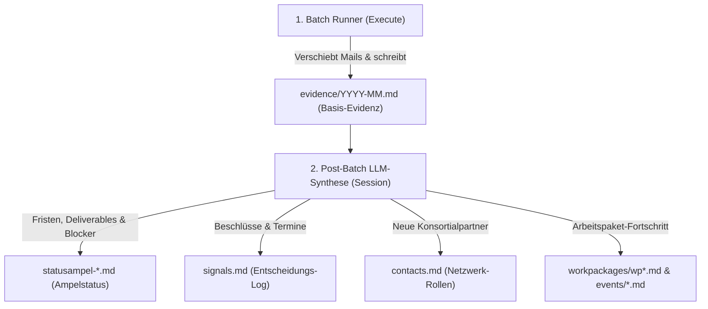

# Feature Requests — Office Intelligence & Mail-Desk

Dieses Dokument fasst die in der Session ab 01.09.2026 erarbeiteten Architektur- und Funktionserweiterungen für das Repository `office-intelligence` (insbesondere die Skills `project-catalog-entry` und `mail-desk`) zusammen. Der Status wurde am 08.09.2026 gegen den Session-Ausgangspunkt `fb9ba3e5` abgeglichen und bis zum Abschluss von FR-01b1 sowie FR-06 fortgeschrieben.

## Statusabgleich zur Session

| ID | Status | In dieser Session umgesetzt | Kurzurteil |
| --- | --- | --- | --- |
| `FR-01` | 🟡 FR-01a/FR-01b1 abgeschlossen, FR-01b2 offen | v3-Schema, Vorlagen, Beispielkatalog, Validator, konservatives Migrationswerkzeug und Tests | Produktiver Dry-run und Backfill bleiben ausdrücklich FR-01b2. |
| `FR-02` | ⬜ offen | Nein | Es gibt weiterhin nur Projekt-Root-Matching und ein auf 30 Zeilen begrenztes Preview; keine hierarchische Artefaktauflösung und keine Full-Body-Eskalation. |
| `FR-03` | 🟡 teilweise, bereits vor der Session | Nein, abgesehen von einer redaktionellen Frontmatter-Korrektur | Subtopics besitzen bereits Aliase, Keywords, Kontakte und optionales `cloud_sync`; der Classifier konsumiert jedoch nur Aliase und Keywords und gibt keinen Subtopic-Treffer aus. |
| `FR-04` | ⏸️ zurückgestellt / depriorisiert | Nein | Auf Nutzeranweisung nach hinten gestellt; Fokus liegt auf der inhaltlichen Synthese (FR-06) und Schema-Vertiefung. |
| `FR-05` | ✅ abgeschlossen | Ja: alle acht Handler ausgelagert | `search`, `resolve`, `inspect`, `draft`, `sync_sent`, `execute`, `verify` und `pipeline` liegen in `scripts/core/modes/`; der Runner umfasst 952 physische Zeilen und behält nur CLI-/Dispatch-/Kompatibilitätsfassaden sowie gemeinsame Fetch-Helper. |
| `FR-06` | ✅ abgeschlossen | Ja: U-1 bis U-5, manueller Pilot, Telemetrie, reviewbare Targets und Session-Handoff | Die technische Zwei-Stufen-Architektur ist abgeschlossen; die konkrete inhaltliche Synthese bleibt absichtlich eine LLM-geführte Laufzeitpflicht und wird nicht vom Python-Runner behauptet oder automatisiert. |

`🟠` bezeichnet dokumentierte Planung ohne vollständige Funktionsimplementierung, `🟡` eine belastbare Teilgrundlage, `⬜` ein noch nicht begonnenes Ziel und `⏸️` ein bewusst depriorisiertes Vorhaben.

---

## Inhaltsübersicht

1. [FR-01: Schema-Erweiterung für `projects.json` & `project-catalog-entry`](#fr-01-schema-erweiterung-für-projectsjson--project-catalog-entry)
2. [FR-02: Hierarchische WP-/Deliverable-Erkennung & Full-Body-Eskalation in `mail-desk`](#fr-02-hierarchische-wp-deliverable-erkennung--full-body-eskalation-in-mail-desk)
3. [FR-03: Subtopic-Strukturierung & Signalisierung in `topics.json`](#fr-03-subtopic-strukturierung--signalisierung-in-topicsjson)
4. [FR-04: Thematischer Dossier-Modus / Projekt-Fokus-Workflow (`batch-dossier.json`) — ZURÜCKGESTELLT](#fr-04-thematischer-dossier-modus--projekt-fokus-workflow-batch-dossierjson)
5. [FR-05: Modulare Reorganisation des Batch-Runners (`scripts/core/modes/`)](#fr-05-modulare-reorganisation-des-batch-runners-scriptscoremodes)
6. [FR-06: Post-Batch LLM Projekt-Synthese & Knowledge-Layer Synchronisation](#fr-06-post-batch-llm-projekt-synthese--knowledge-layer-synchronisation)

---

## FR-01: Schema-Erweiterung für `projects.json` & `project-catalog-entry`

**Status:** 🟡 **FR-01a und FR-01b1 abgeschlossen.** Das normative v3-Schema, Vorlagen, generische Fixtures, Validator und ein konservatives Migrationswerkzeug sind vorhanden. **FR-01b2 bleibt offen:** Produktiver Dry-run und Backfill realer Kataloge wurden nicht durchgeführt.

### Problemstellung
In [`projects.json`](../../boku-user/memory/references/projects/projects.json) werden Workpackages bisher flach geführt. Tasks (z. B. `T1.7`), Deliverables (z. B. `D1.2`) und Milestones (z. B. `MS1`) liegen unstrukturiert als Strings in `"aliases"`.
- Dem Skill [`project-catalog-entry`](skills/project-catalog-entry/SKILL.md) fehlt ein normatives Schema für Teilaufgaben und Meilensteine.
- Es ist maschinell nicht ersichtlich, welche Aufgaben bei der BOKU liegen (`boku_role`, z. B. *Co-Lead Quality*) und welche Partner welche Deliverables verantworten.

### Ziel-Spezifikation

1. **Strukturierung von `workpackages`:**
   - Jedes WP erhält strukturierte Listen für `tasks` und `deliverables`.
   - Felder für `lead` und `boku_role`.
2. **Milestones auf Projektebene:**
   - Meilensteine spannen oft über mehrere WPs und markieren Phasenabschlüsse des Gesamtprojekts. Sie liegen daher direkt auf Projektebene (`milestones: [...]`) mit Verweisen (`related_wps`) und optionalen Vorbedingungen (`prerequisites`).

```json
{
  "id": "meshe",
  "title": "MESHE – Microcredentials Exchange System for Higher Education in Europe",
  "kuerzel": "MESHE",
  "mailbox_folder": "Projekte/MESHE",
  "workpackages": [
    {
      "id": "wp1",
      "number": 1,
      "title": "Project Management, Coordination, Quality and Evaluation",
      "lead": "EUCEN",
      "boku_role": "Co-Lead Quality",
      "status": "active",
      "tasks": [
        {
          "id": "T1.7",
          "title": "Drafting the Quality and Evaluation Plan",
          "lead": "BOKU",
          "keywords": ["Quality Plan", "QM Plan", "Handbook", "Evaluation Plan"]
        },
        {
          "id": "T1.8",
          "title": "Individual Risk Management Grid",
          "lead": "BOKU",
          "keywords": ["Risk Management Grid", "Risk Grid", "Risikoanalyse"]
        }
      ],
      "deliverables": [
        {
          "id": "D1.2",
          "title": "Quality and evaluation plan, including tools IPR and reports",
          "lead": "BOKU",
          "type": "R — Document, report",
          "due_month": "Ongoing, M1–M36"
        }
      ]
    }
  ],
  "milestones": [
    {
      "id": "MS1",
      "title": "Kick-off meeting held",
      "due_month": "M2",
      "related_wps": ["wp1"],
      "prerequisites": "Grant Agreement signed"
    },
    {
      "id": "MS5",
      "title": "Quality Plan approved by consortium",
      "due_month": "M6",
      "related_wps": ["wp1"],
      "prerequisites": "Draft Quality Plan delivered (D1.2)"
    }
  ]
}
```

### Abgrenzung FR-01a / FR-01b

FR-01a liefert `projects.schema.json`, den read-only `validate_projects.py`, schema-v3-Vorlagen und Fixtures. FR-01b1 liefert `scripts/migrate_project_wps.py`: Default-Dry-run, deterministischen Diff, atomaren Apply nur mit kanonisch verifizierter Lock-Ownership, v3-Validierung und Pending-Diagnostics für mehrdeutige Quellen. FR-01b2 umfasst erst den separat freizugebenden produktiven Dry-run und Backfill aus realen Markdown-Workpackages. Keine realen Projektinformationen wurden erfunden oder migriert.

### Kommentar und Schärfung

Die Erweiterung ist Voraussetzung für FR-02. Die Milestone-Inkonsistenz ist bereinigt: Milestones liegen normativ auf Projektebene und verweisen über `related_wps` auf WPs.

Das Migrationsskript liegt als wiederverwendbares Tool unter `skills/project-catalog-entry/scripts/`. Es arbeitet standardmäßig im Dry-run, ist idempotent, schreibt atomar nur nach explizitem Apply und Lock-Check und migriert mehrdeutige Quellen nie autonom. Ein realer Backfill bleibt FR-01b2.

---

## FR-02: Hierarchische WP-/Deliverable-Erkennung & Full-Body-Eskalation in `mail-desk`

**Status:** ⬜ Offen. Der aktuelle Classifier wertet bei Projekten ausschließlich Root-Felder aus. `tasks`, `deliverables` und `milestones` werden nicht gelesen. `get_single_email_details()` ruft zwar `himalaya message read --preview` auf, schneidet den Body aber weiterhin auf standardmäßig 30 Zeilen ab; eine zweite, signalgesteuerte Volltextstufe fehlt.

### Problemstellung
Derzeit matched [`scripts/core/classifier.py`](skills/mail-desk/scripts/core/classifier.py) Mails nur gegen Root-Metadaten von Projekten. Wird eine Mail wie *„Mesche QM Plan Handbook 1. Draft“* verarbeitet, entsteht lediglich ein generischer Evidenzeintrag (*„Projektbezogene Abstimmung zu MESHE“*), ohne Bezug zu Deliverable `D1.2` oder Task `T1.7`. Zudem werden standardmäßig nur die ersten 30 Zeilen Preview geladen.

### Ziel-Spezifikation

1. **Hierarchisches Matching (`classifier.py`):**
   - Auswertung der neuen `tasks`-, `deliverables`- und `milestones`-Objekte im Speicher.
   - Erkennung von Codes (`T1.7`, `D1.2`, `MS5`) sowie zugehörigen Fachbegriffen im Betreff und Mailtext.
2. **Programmatische Lesegrad-Eskalation (`Full Body`):**
   - Sobald Artefakt-Signale (*„QM Plan“*, *„Draft“*, *„Handbook“*, *„Deliverable“*, *„Agreement“*, *„Red Flags“*, *„Audit“*) oder Handlungsbedarfe (`needs_reply: true`) vorliegen, ruft der Runner automatisch `himalaya message read <id>` (Volltext) ab.
3. **Präzise Evidenz-Generierung:**
   - Deterministische Strukturierung des Monatslogs:
     ```markdown
     - 2026-02-17 — Mesche QM Plan Handbook 1. Draft.
       - Message-ID: `69949823020000f1000ce9b8@gwia1.boku.ac.at` (Christina Paulus)
       - Kontext: [MESHE | WP1 / T1.7 / D1.2 (Quality and Evaluation Plan, Lead: BOKU)]
       - Aussagekern: BOKU legt ersten Entwurf für D1.2 / T1.7 (QM Plan Handbook) vor.
     ```

### Kommentar und Schärfung

FR-02 sollte erst nach dem stabilen Schema aus FR-01 umgesetzt werden. Das Matching sollte exakte Codes (`T1.7`, `D1.2`, `MS5`) höher gewichten als freie Keywords und bei Mehrdeutigkeit mehrere Kandidaten ausgeben, statt einen scheinbar sicheren Treffer zu erfinden. Der erkannte Kontext sollte zusätzlich strukturiert im Decision-/Evidence-Objekt stehen; die Markdown-Zeile allein ist keine gute Maschinenschnittstelle.

Die Full-Body-Logik sollte als klarer Zwei-Pass-Flow gebaut werden: Preview klassifizieren, definierte Signale oder unzureichende Evidenz feststellen, dann genau diese Nachricht vollständig lesen und erneut klassifizieren. `needs_reply` allein ist als Trigger zu zirkulär, weil es zunächst selbst aus dem gekürzten Inhalt abgeleitet wird. Contract-Tests sollten außerdem sicherstellen, dass Volltext nur bei den dokumentierten Triggern geladen wird und ein Read-Fehler keine unvollständige Aussage als gesichert protokolliert.

### Erkenntnisse aus dem 10-Mail-Pilotlauf (07.09.2026)

- **Fehlende WP/Task-Ebene im Manifest:**
  Bei Envelope 9060 (*„MESHE WP2 BOKU Focus Group“*) und Envelopes 9055/9056 (*„Li4LaM: Finding a date to discuss the Handbook for Course Design, Tools and the Process of RPL“*) erkannte der Classifier nur das Root-Projekt (`meshe`, `li4lam`). Weder `workpackage: "wp2"`, `task: "t2.2"` noch der RPL-Handbook-Kontext wurden im JSON abgebildet.
- **Notwendigkeit signalgestützter Full-Body-Eskalation:**
  Im 30-Zeilen-Preview von Env 9060 erschien nur eine kurze Höflichkeitsfloskel. Erst der gezielte Volltextabruf (`himalaya message read 60`) deckte den kritischen Sachverhalt auf: Die BOKU-Fokusgruppe konnte am 18.05. mangels Teilnehmern nicht stattfinden, Martin informierte WP2-Lead Lyndsey El Amoud (UCC) und diese mahnte höchste Dringlichkeit an. Ohne Full-Body-Eskalation wäre dieses kritische Projektsignal im Batch verloren gegangen.
- **Zielstruktur im Manifest:**
  Das `decision`-Objekt im Manifest sollte künftig strukturiert `workpackage`, `task` und `read_escalation` tragen:
  ```json
  "decision": {
    "kind": "project",
    "id": "meshe",
    "workpackage": "wp2",
    "task": "t2.2",
    "read_escalation": {
      "level": "full_body",
      "triggers": ["focus group", "wp2"]
    }
  }
  ```

---

## FR-03: Subtopic-Strukturierung & Signalisierung in `topics.json`

**Status:** 🟡 Teilweise vorhanden, aber nicht in dieser Session funktional erweitert. Das bestehende Topic-Schema enthält bereits `subtopics[].aliases`, `keywords`, `contacts`, `cloud_sync` und `status`; der Classifier übernimmt daraus derzeit nur Aliase und Keywords in das Parent-Topic-Matching. Subtopic-Kontakte, eigene Betreffmuster und die Identität des getroffenen Subtopics werden nicht verarbeitet. Event-Unterordner sind bereits dokumentiert, ein normativer `operations/`-Vertrag fehlt.

### Problemstellung
Themen (Topics) sind Linien-, Dauer- und Betriebsaufgaben ohne starre EU-Workpackages. Bisher sind `subtopics` in [`topics.json`](../../boku-user/memory/references/topics/topics.json) häufig leere Arrays ohne funktionale Routing-Signale, was zu unpräziser Klassifikation führt.

### Ziel-Spezifikation
Strukturierte Anreicherung der Subtopics mit eigenen Signal-Attributen:
- `keywords`: Spezifische Fachbegriffe (z. B. *„stundensaldo“*, *„argedata“*, *„zeiterfassung“*).
- `typical_subject_patterns`: Typische Betreff-Muster (z. B. *„Übertragung Stundensaldo“*, *„[Ticket#...“*).
- `contacts`: Funktionsadressen und zuständige Kolleg:innen (z. B. `h17700_argedata@boku.ac.at`).
- Saubere Trennung von Subtopics, Events/Konferenzen (`events/<slug>/`) und Dauerprozessen (`operations/`).

### Kommentar und Schärfung

Die Idee ist fachlich stimmig, sollte aber das bereits etablierte Feld `typical_subject_patterns` verwenden und nicht mit `typical_patterns` ein zweites Vokabular einführen. Der Classifier sollte einen Subtopic-Treffer als strukturierten Kontext (`topic_id`, `subtopic_id`, Match-Gründe) zurückgeben; bloßes Zusammenführen aller Signale auf Parent-Ebene verliert genau die gewünschte Präzision.

Für `contacts` ist zu definieren, ob sie Root-Kontakte ergänzen oder auf das Subtopic einschränken. `operations/` sollte erst nach einer kurzen fachlichen Definition eingeführt werden: Dauerprozess, Ablageobjekt und Evidenzpfad müssen klar von einem Subtopic und einem Event unterscheidbar sein. FR-03 ist klein genug für ein eigenes Paket aus Schema/Template, Classifier und gezielten Tests.

### Erkenntnisse aus dem 10-Mail-Pilotlauf (07.09.2026)

- **Vermeidung von `"evidence": null` bei Topic-Mails:**
  Im Pilotlauf wurden vier Mails zum Thema EUCEN-Konferenz / Dienstreise Cagliari (Env 9057, 9058, 9059, 9062) verarbeitet. Da der Classifier bisher nur auf Topic-Ebene matcht, wurden die Mails generisch als `Themen/Netzwerke` klassifiziert und erhielten `"evidence": null`.
- **Existierende Ziel-Dossiers werden verfehlt:**
  Im Workspace existiert bereits das präzise Subtopic-Dossier `memory/references/topics/dienstreisen/subtopics/2026-06-cagliari-eucen-conference.md`, in welches die Konferenzrechnungen (`spol@unica.it`) und Social-Event-Details (`alice.sgualdini@unica.it`) gehören.
- **Manifest-Anreicherung:**
  Mit FR-03 erzeugt der Classifier strukturierte Subtopic- und Event-Referenzen direkt im Manifest:
  ```json
  "decision": {
    "kind": "topic",
    "id": "dienstreisen",
    "subtopic": "2026-06-cagliari-eucen-conference"
  },
  "evidence": {
    "file": "memory/evidence/topics/dienstreisen/2026-06.md",
    "entry": "… kanonischer Mail-Nachweis mit Message-ID …"
  },
  "synthesis_targets": [
    {
      "file": "memory/references/topics/dienstreisen/subtopics/2026-06-cagliari-eucen-conference.md",
      "type": "event_dossier",
      "section": "Rechnungen & Logistik"
    }
  ]
  ```

---

## FR-04: Thematischer Dossier-Modus / Projekt-Fokus-Workflow (`batch-dossier.json`)

**Status:** ⬜ Offen. Im Runner existieren nur `inspect`, `draft`, `sync_sent`, `execute`, `verify`, `pipeline`, `search` und `resolve`. Es gibt weder einen Dossier-Manifestkandidaten noch Dossier-spezifische Handler oder Tests.

### Problemstellung
Bisher erfolgt die Abarbeitung der Mailbox rein chronologisch (Tag für Tag über alle Themen gemischt). Wenn der Nutzer jedoch gezielt an einem Projekt (z. B. `MESHE`) arbeiten möchte, müssen alle dazu gehörenden Mails aus der `INBOX` extrahiert, verarbeitet und die entsprechenden Projektunterlagen vorab synchronisiert werden.

### Ziel-Spezifikation


1. **Manifest-Format (`batch-dossier.json`):**
   ```json
   {
     "mode": "dossier",
     "project": "meshe",
     "source_folder": "INBOX",
     "auto_query_from_catalog": true,
     "max_count": 50,
     "actions": {
       "route_and_index": true,
       "flush_evidence": true,
       "sync_project_references": true,
       "check_todos": true
     },
     "delete_input_on_success": true
   }
   ```
2. **Katalog-gestützter IMAP-Filter:**
   - Der Runner baut aus den Projektmetadaten (Kürzel, Aliase, Domains `@eucen.eu`, Kontakte) automatisch eine optimierte IMAP-Suche auf (`SEARCH (OR (SUBJECT "MESHE") (FROM "eucen.eu"))`).
3. **Integrierter Synthese-Schritt:**
   - Nach dem Verschieben der Mails aktualisiert der Agent automatisch:
     - `statusampel-*.md`
     - `signals.md` (Fristen, Risiken)
     - `contacts.md`
4. **Übergabe in die Arbeitsdokumente:**
   - Ausgabe eines Dossier-Briefings mit direkten Links zu betroffenen Dateien im konfigurierten Cloud-Atlas-Mirror (z. B. `memory/cloud/projects/<project>/<storage_id>/...`) via passendem Dokument-Skill.

### Kommentar und Schärfung

Das Ziel ist nützlich, aber als einzelnes Paket zu groß und überschreitet mehrere Skill-Grenzen. Sinnvoll sind mindestens vier getrennte Schritte: kataloggestützte Suche und Manifest, kontrolliertes Routing/Indexing, reviewbare Synthese sowie Übergabe an `cloud-atlas` und `task-desk`. Der Mail-Desk sollte diese Skills orchestrieren, ihre Fachlogik aber nicht duplizieren.

Die Reihenfolge ist derzeit widersprüchlich: Die Problemstellung verlangt eine Synchronisation der Projektunterlagen vor der Mailbearbeitung, das Diagramm setzt `Memory-Sync` danach. Empfehlenswert ist `Cloud-Atlas Preflight/Sync → Mail Harvest/Triage → Synthese → Action Handover`. Automatische Änderungen an `statusampel`, `signals.md` und `contacts.md` sollten zunächst als Vorschlag mit Quellenankern entstehen; nur deterministische Ergänzungen dürfen ohne inhaltliches Human Gate geschrieben werden. IMAP-/Himalaya-Abfragen müssen adaptergerecht erzeugt, begrenzt und vor der Mutation als Dry-Run sichtbar sein.

---

## FR-05: Modulare Reorganisation des Batch-Runners (`scripts/core/modes/`)

**Status:** ✅ Abgeschlossen. Alle acht Handler (`run_search_mode`, `run_resolve_mode`, `run_inspect_mode`, `run_draft_mode`, `run_sync_sent_mode`, `run_execute_mode`, `run_verify_mode` und `run_pipeline_mode`) liegen in `scripts/core/modes/`. `mail_desk_batch_runner.py` umfasst 952 physische Zeilen; er behält den kanonischen CLI-Rand, Dispatch, Kompatibilitätsfassaden und die gemeinsamen Envelope-/Fetch-Helper.

### Problemstellung
Vor dem ersten Modulschnitt lag [`mail_desk_batch_runner.py`](skills/mail-desk/scripts/mail_desk_batch_runner.py) bereits über der 1.500-Zeilen-Schwelle. Basis-Hilfsfunktionen sowie alle acht Modi sind inzwischen in `scripts/core/` ausgelagert. Im Hauptskript verbleiben bewusst nur der CLI-Entrypoint, Konfigurations- und Envelope-Grenzen, Dispatch, Laufzeit-DI-Fassaden und die gemeinsamen Mail-Fetch-Helper.

### Ziel-Spezifikation
Sobald weitere Modi hinzukommen (z. B. der Dossier-Modus oder erweiterte AI-Pipelines) oder die Dateigröße 1.500 Zeilen überschreitet, wird die Modi-Logik in ein Untermodul ausgelagert:

```text
skills/mail-desk/scripts/
├── mail_desk_batch_runner.py       # Schlanker CLI-Dispatcher (~150 Zeilen)
└── core/
    ├── himalaya.py
    ├── index.py
    ├── classifier.py
    ├── evidence.py
    ├── sent_indexer.py
    ├── action_log.py
    └── modes/                      # Ausgelagerte Modus-Handler
        ├── __init__.py
        ├── inspect.py              # run_inspect_mode ✅
        ├── draft.py                # run_draft_mode ✅
        ├── sync_sent.py            # run_sync_sent_mode ✅
        ├── execute.py              # run_execute_mode ✅
        ├── verify.py               # run_verify_mode ✅
        ├── pipeline.py             # run_pipeline_mode ✅
        ├── dossier.py              # run_dossier_mode (FR-04)
        ├── search.py               # run_search_mode ✅
        └── resolve.py              # run_resolve_mode ✅
```

### Kommentar und Schärfung

FR-05 sollte vor FR-04 abgeschlossen werden: Die im Request genannte 1.500-Zeilen-Schwelle war bereits überschritten und wurde durch den ersten Schnitt knapp unterschritten. Die Zielgröße von ungefähr 150 Zeilen für den Dispatcher ist plausibel, sollte aber kein hartes Abnahmekriterium sein; wichtiger sind stabile Imports, genau ein kanonischer Envelope am CLI-Rand und unveränderte Modussemantik.

Die Auslagerung erfolgte inkrementell. `search`, `resolve`, `inspect`, `draft`, `sync_sent`, `execute`, `verify` und `pipeline` sind abgeschlossen. Die Regressionen decken Envelope-, Partial-Failure-, Cleanup- und Manifest-Sicherheit sowie die Laufzeit-DI-Fassaden für die Mutations- und Orchestrierungspfade ab. `dossier.py` bleibt ausdrücklich Teil des zurückgestellten FR-04 und wurde nicht angelegt.

### Umsetzungsnachweis: inkrementelle Modulschnitte

- `scripts/core/modes/search.py`, `resolve.py`, `inspect.py`, `draft.py`, `sync_sent.py`, `execute.py`, `verify.py` und `pipeline.py` kapseln alle acht Handler und sind unabhängig vom CLI-Entrypoint testbar.
- Der Runner importiert `search` und `resolve` weiterhin direkt. Für die übrigen sechs Modi hält er schmale, gleichnamige Kompatibilitäts-Fassaden: Sie übergeben die bisherigen Runner-Abhängigkeiten zur Laufzeit an die extrahierte Logik. Damit bleiben Dispatch sowie vorhandene Imports und Patch-Schnittstellen stabil, ohne einen Importzyklus zu erzeugen.
- Regressionstests decken Ergebnisform, atomare Ausgabe, Inspection- und Draft-Cache-Semantik, Sent-Synchronisations-Weitergabe, Execute-Routing (Copy → Verify → Delete), Evidence-/Index-/Log-Reihenfolge, Partial Failures, Pipeline-Orchestrierung, Verify-Batch-Dateiauswahl, Konsistenz-/Folder-Checks, Progress-Abschluss, explizite und automatische Fallauflösung sowie Alias-Dispatch ab.

---

## FR-06: Post-Batch LLM Projekt-Synthese & Knowledge-Layer Synchronisation

**Status:** ✅ Abgeschlossen (07.09.2026). Die technische Zwei-Stufen-Architektur umfasst die Pilot-Härtung U-1 bis U-5, den manuellen Pilot, FR-06a-Telemetrie, FR-06b-Targets sowie den FR-06c-Session-Handoff und ist regressionstestbar implementiert. Die konkrete inhaltliche Synthese bleibt absichtlich eine LLM-geführte Laufzeitpflicht: Der Python-Runner erstellt oder ändert keine Wissensdateien und behauptet keinen inhaltlichen Abschluss.

### Problemstellung
Bisher endete der Batch-Workflow operativ mit dem Abschluss des Python-Runners. Dadurch wuchsen zwar die monatlichen Evidenzlogs (`evidence/YYYY-MM.md`), aber die tatsächlichen Arbeits- und Steuerungsdateien der Projekte veralteten:
- **Statusampeln (`statusampel-*.md`)** bildeten neue Meilensteine oder gelöste Blocker nicht ab.
- **Signale (`signals.md`)** verpassten neu vereinbarte Beschlüsse und Fristen.
- **Kontakte (`contacts.md`)** erfassten neu aufgetretene Konsortialpartner nicht.
- **Events (`events/*.md`)** erhielten keine Rückmeldungen über Teilnehmerbestätigungen oder Absagen/Verschiebungen.

Da diese inhaltliche Übertragung semantisches Textverständnis und strategische Einordnung erfordert, kann und soll sie nicht durch starre Regex-Skripte im Python-Runner erfolgen, sondern als **verbindlicher zweiter Schritt (LLM-Synthese)** direkt nach dem Batch-Lauf ausgeführt werden.

### Ziel-Spezifikation (Das 2-Stufen-Protokoll)



1. **FR-06b — Manifest-Erweiterung (`synthesis_targets`) — abgeschlossen:**
   - Jedes Item im Execute-Manifest kann konkrete Zieldateien für die Synthese benennen. Autonome Drafts liefern dabei bewusst `synthesis_targets: []`; erst ein Mensch oder LLM reichert den Draft zwischen `draft` und `execute` reviewbar an:
     ```json
     "synthesis_targets": [
       {
         "file": "memory/references/projects/meshe/events/2026-05-18-fokusgruppe-boku-weiterbildung.md",
         "type": "event_dossier",
         "recommended_action": "update_status"
       },
       {
         "file": "memory/references/projects/meshe/statusampel-boku-p6.md",
         "type": "statusampel",
         "task_anchor": "WP2 — T2.2 FDGs"
       }
     ]
     ```
2. **FR-06a — Execute-/Pipeline-Telemetrie (abgeschlossen):**
   - Beim Abschluss eines `execute`- oder `pipeline`-Laufs emittiert der Runner in `data.telemetry` eine Liste der erfolgreich berührten Projekt- und Topic-Slugs:
     ```json
     "telemetry": {
       "affected_projects": ["meshe", "li4lam"],
       "affected_topics": ["netzwerke", "boku-organisation"],
       "synthesis_required": true
     }
     ```
3. **Verbindliche LLM-Checkliste je berührtem Projekt:**
   - **`statusampel-*.md`:** Gibt es neue Meilensteine, Deliverable-Fortschritte oder veränderte Ampelfarben?
   - **`signals.md`:** Wurden verbindliche Termine, Fristen oder Risiken vereinbart?
   - **`contacts.md`:** Sind neue Schlüsselpersonen aufgetaucht?
   - **`workpackages/wp*.md`:** Gibt es neue Deliverable-Entwürfe oder Teilaufgabenabschlüsse?
   - **`events/*.md`:** Wurden Konferenzrechnungen, Anmeldungen oder Tagungsdetails übermittelt?
4. **FR-06c — Abschlussbericht / Session-Handoff (abgeschlossen):**
   - `execute` und `pipeline` geben einen strikt versionierten, fail-closed
     `synthesis_handoff` aus. Er enthält nur erfolgreiche, gepaarte Project-/Topic-
     Items in stabiler Reihenfolge und bewahrt jede Mail als eigene Evidenzquelle.
     Fehlende Targets setzen `target_selection_required: true`; die Pipeline behält
     einen validen pending Handoff auch bei einem nachfolgenden Verify-Fehler.
   - Bei pending Handoff führt das LLM die quellengebundene Synthese aus und gibt
     danach den kompakten **Projekt-Wissensbericht** aus:
     - *„MESHE: Statusampel für WP2 und Eventdossier aktualisiert (Fokusgruppe BOKU auf verschoben gesetzt).“*
     - *„Li4LaM: Schlüsselkontakt Belachew Yirsaw Alemu ergänzt.“*
     - *„Dienstreisen: EUCEN-Konferenzrechnung in Cagliari-Event verknüpft.“*

### Bereits umgesetzte Arbeiten und offene technische Lücke (Stand 07.09.2026)

1. **Pilot-Härtung U-1 bis U-5 (`mail_desk_batch_runner.py`):**
   - **U-1:** Filterergebnisse werden anhand geparster RFC-Daten, nicht lexikografisch, sortiert.
   - **U-2:** Abruffenster wachsen bis 2.500 Envelopes, damit bekannte IDs neue Mails nicht verdecken.
   - **U-3:** `--query` (`-q`) und `--date` werden für `inspect`, `draft` und `pipeline` bis zum Envelope-Abruf weitergereicht.
   - **U-4:** Himalaya-Query- und Parsefehler werden explizit gemeldet.
   - **U-5:** Lesen und Löschen temporärer Manifeste verwenden einen begrenzten exponentiellen PermissionError-Backoff.
2. **Manuelle Synthese-Leitplanke (`mail-desk/SKILL.md`):**
   - Berührte Steuerungsdateien werden geprüft, aber nur bei belastbaren, mailgebundenen neuen Erkenntnissen geändert. Ein quellengebundener No-op ist zulässig und wird berichtet.
3. **Praxis-Pilot (10 Mails, 18.–20. Mai 2026):**
   - 10/10 Mails fehlerfrei transferiert, verifiziert, indiziert und Basis-Evidenz geschrieben.
   - Die Post-Batch Synthese wurde im Boku-User-Workflow manuell durchgeführt: Ein MESHE-Fokusgruppen-Eventdossier wurde auf Basis des Volltextes von Envelope 60 von `geplant` auf `verschoben / nachzuholen` korrigiert.
4. **FR-06a — umgesetzt:**
   - Der Execute- und Pipeline-Envelope enthält unter `data.telemetry` exakt `affected_projects`, `affected_topics` und `synthesis_required`. Nur erfolgreiche Projekt-/Topic-Items mit nichtleerer String-ID werden in stabiler Batch-Reihenfolge gezählt; Duplikate sowie Review- und Fehlerschritte bleiben außen vor.
   - Die Telemetrie löst keine Synthese aus und verändert keine Wissensdateien.
5. **Abschlussgrenze für FR-06:**
   - Die technische Zwei-Stufen-Architektur ist abgeschlossen. Der Session-Handoff
     löst die nachgelagerte, quellengebundene LLM-Synthese verbindlich aus, aber der
     Python-Runner automatisiert keine Wissensdatei-Änderung und behauptet keinen
     Abschluss. Diese konkrete Inhaltsarbeit bleibt absichtlich eine Laufzeitpflicht
     des LLM unter fortgeltenden Lock- und Approval-Grenzen.
